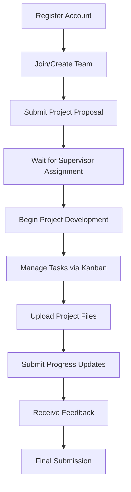
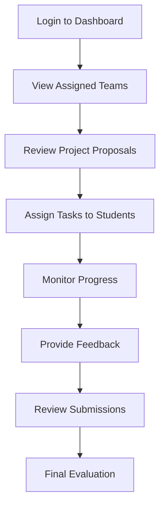

# Graduation Project Management System (GPMS)


## 📋 Table of Contents

- [Overview](#overview)
- [Features](#features)
- [Technology Stack](#technology-stack)
- [User Roles & Workflows](#user-roles--workflows)
- [Getting Started](#getting-started)
- [Project Structure](#project-structure)
- [API Documentation](#api-documentation)
- [Database Schema](#database-schema)
- [The Design](#database-schema)
- [Development Timeline](#development-timeline)
- [Contributing](#contributing)
- [License](#license)

## 🎯 Overview

Managing graduation projects in universities can be inefficient and scattered across multiple platforms. The **Graduation Project Management System (GPMS)** provides a centralized solution that enhances collaboration between students, supervisors, and administrators while ensuring standardized evaluation processes.

### Problem Statement
- Lack of centralized project management
- Inefficient communication between stakeholders
- Manual tracking of milestones and deadlines
- Inconsistent evaluation processes
- Scattered document management

### Solution
GPMS provides a unified platform that digitizes and streamlines the entire graduation project lifecycle, improving efficiency and communication for all stakeholders.

## ✨ Features

### 🎓 For Students
- **Team Management**: Create and join project teams
- **Project Proposal**: Submit and track project proposals
- **Task Management**: Kanban-style task tracking and assignment
- **File Management**: Upload and organize project documents
- **Progress Tracking**: Monitor milestones and deadlines
- **Feedback System**: Receive and respond to supervisor feedback
- **Dashboard**: Real-time project status overview

### 👨‍🏫 For Supervisors
- **Project Oversight**: Monitor multiple student projects
- **Team Assignment**: Manage student team assignments
- **Approval Workflow**: Review and approve project proposals
- **Task Supervision**: Assign and track student tasks
- **Feedback System**: Provide structured feedback on submissions
- **File Review**: Access and review student submissions
- **Evaluation Tools**: Grade projects using standardized methods

## 🛠 Technology Stack

### Backend
- **Framework**: ASP.NET Core 8.0
- **Language**: C#
- **Database**: SQL Server with Entity Framework Core 8.0
- **Authentication**: JWT Bearer tokens with ASP.NET Identity
- **Password Hashing**: BCrypt.Net
- **AutoMapper**: Object-to-object mapping
- **API Documentation**: Swagger/OpenAPI (Swashbuckle)
- **Logging**: Built-in ASP.NET Core logging with custom middleware

### Frontend
- **Framework**: React 18 with TypeScript
- **Build Tool**: Vite
- **Styling**: Tailwind CSS
- **UI Components**: Shadcn/ui, Radix UI
- **State Management**: React Context/Hooks + localStorage
- **Routing**: React Router
- **Notifications**: SweetAlert2
- **HTTP Client**: Fetch API

### Database Entities
- **Users**: Base user management
- **Students**: Student-specific data
- **Supervisors**: Supervisor-specific data  
- **Teams**: Project team management
- **Projects**: Project information and tracking
- **KanbanTask**: Task management system
- **StudentTask**: Student-task associations
- **Feedback**: Feedback system between supervisors and students
- **Reply**: Response system for feedback
- **Links**: Project-related links and resources

### DevOps & Tools
- **IDE**: Visual Studio 2022 / Visual Studio Code
- **Version Control**: Git
- **Package Manager**: NuGet (.NET), npm (Frontend)
<!-- - **Containerization**: Docker support -->
- **Database Migrations**: Entity Framework Core Migrations

## 👥 User Roles & Workflows

### Student Workflow


### Supervisor Workflow


## 🚀 Getting Started

### Prerequisites

- **.NET 8.0 SDK** or later
- **SQL Server** (LocalDB, Express, or full version)
- **Visual Studio 2022** or **Visual Studio Code**
- **Node.js** (v18 or higher) for frontend
- **Git**

### Installation

1. **Clone the repository**
   ```bash
   git clone https://github.com/nizarLubbad/Graduation-Project-Management-System.git
   cd Graduation-Project-Management-System
   ```

2. **Backend Setup**
   ```bash
   cd backend/GPMS
   
   # Restore NuGet packages
   dotnet restore
   
   # Update connection string in appsettings.json
   # "DefaultConnection": "Server=(localdb)\\mssqllocaldb;Database=GPMSDb;Trusted_Connection=true;"
   
   # Apply database migrations
   dotnet ef database update
   
   # Build the project
   dotnet build
   ```

3. **Frontend Setup**
   ```bash
   cd ../../frontend
   
   # Install npm packages
   npm install
   ```

4. **Configuration Files**
   
   **Backend `appsettings.json`:**
   ```json
   {
     "ConnectionStrings": {
       "DefaultConnection": "Server=(localdb)\\mssqllocaldb;Database=GPMSDb;Trusted_Connection=true;"
     },
     "JwtSettings": {
       "SecretKey": "your-super-secret-jwt-key-minimum-32-characters",
       "ExpiresInMinutes": 1440
     },
     "Logging": {
       "LogLevel": {
         "Default": "Information",
         "Microsoft.AspNetCore": "Warning"
       }
     }
   }
   ```
   
   **Frontend `.env` (optional):**
   ```env
   VITE_API_BASE_URL=https://localhost:7000/api
   VITE_APP_NAME=GPMS
   ```

5. **Run the Application**
   
   **Backend (Terminal 1):**
   ```bash
   cd backend/GPMS
   dotnet run
   # or for watch mode
   dotnet watch run
   ```
   
   **Frontend (Terminal 2):**
   ```bash
   cd frontend
   npm run dev
   ```

6. **Access the Application**
   - Frontend: http://localhost:5173
   - Backend API: https://localhost:7000
   - Swagger UI: https://localhost:7000/swagger

## 📁 Project Structure

```
Graduation-Project-Management-System/
├── backend/
│   └── GPMS/                         # ASP.NET Core Web API
│       ├── Controllers/              # API Controllers
│       ├── Models/                   # Entity Models
│       │   ├── Student.cs
│       │   ├── Supervisor.cs
│       │   ├── Team.cs
│       │   ├── Project.cs
│       │   ├── KanbanTask.cs
│       │   ├── Feedback.cs
│       │   └── User.cs
│       ├── Data/
│       │   └── AppDbContext.cs       # Entity Framework DbContext
│       ├── Migrations/               # EF Core Migrations
│       ├── Services/                 # Business Logic Services
│       ├── DTOs/                     # Data Transfer Objects
│       ├── Middleware/               # Custom Middleware
│       │   ├── LoggingMiddleware.cs
│       │   └── ExceptionHandlingMiddleware.cs
│       ├── Program.cs                # Application entry point
│       ├── appsettings.json          # Configuration
│       └── GPMS.csproj               # Project file
│
├── frontend/                         # React TypeScript SPA
│   ├── src/
│   │   ├── auth/                     # Authentication components
│   │   │   ├── AuthPage.tsx
│   │   │   └── ProtectedRoute.tsx
│   │   ├── dashboards/               # Role-specific dashboards
│   │   │   ├── StudentDashboard.tsx
│   │   │   └── SupervisorDashboard.tsx
│   │   ├── Component/                # Reusable components
│   │   │   ├── StudentProjectFiles.tsx
│   │   │   ├── SupervisorProjectFiles.tsx
│   │   │   ├── ProjectHistory.tsx
│   │   │   ├── StudentKanbanWrapper.tsx
│   │   │   └── SupervisorProjectKanban.tsx
│   │   ├── booking/                  # Team and supervisor management
│   │   │   ├── CreateTeam.tsx
│   │   │   └── BookingSupervisor.tsx
│   │   ├── types/
│   │   │   └── types.ts              # TypeScript interfaces
│   │   ├── App.tsx                   # Main app component
│   │   └── main.tsx                  # Entry point
│   ├── public/                       # Static assets
│   ├── package.json
│   ├── vite.config.ts
│   └── tailwind.config.js
│
├── docs/                             # Documentation
└── README.md
```

## 🔌 API Documentation

### Authentication Endpoints
```http
POST       /api/Auth/register/student    
POST       /api/Auth/register/supervisor       
POST       /api/Auth/login              
GET        /api/Auth/getUsers
GET        /api/Auth/status/{userId}
GET        /api/Auth/{userId}
DELETE     /api/Auth/delete-all-users
```

### Feedback
```http
GET        /api/Feedback/Team/{teamId}
GET        /api/Feedback/{feedbackId}
PUT        /api/Feedback/{feedbackId}
DELETE     /api/Feedback/{feedbackId}
POST       /api/Feedback
```

### KanbanTask
```http
GET        /api/KanbanTask/team/{teamId}
GET        /api/KanbanTask
POST       /api/KanbanTask
GET        /api/KanbanTask/{taskId}
PUT        /api/KanbanTask/{taskId}
DELETE     /api/KanbanTask/{taskId}
PATCH      /api/KanbanTask/status
```

### Link
```http
GET        /api/Link
POST       /api/Link
GET        /api/Link/{id}
PUT        /api/Link/{id}
DELETE     /api/Link/{id}
GET        /api/Link/team/{teamId}
GET        /api/Link/student/{studentId}
```

*Access Swagger UI at [Swagger UI](https://backendteam-001-site1.qtempurl.com/swagger/index.html) when the API is running for detailed documentation.*

## 🗄 Database Schema

### Core Entities

#### Users Table
```sql
CREATE TABLE Users (
    Id UNIQUEIDENTIFIER PRIMARY KEY,
    Email NVARCHAR(255) UNIQUE NOT NULL,
    PasswordHash NVARCHAR(255) NOT NULL,
    Name NVARCHAR(100) NOT NULL,
    Role NVARCHAR(50) NOT NULL,
    CreatedAt DATETIME2 DEFAULT GETDATE(),
    IsActive BIT DEFAULT 1
);
```

#### Students Table
```sql
CREATE TABLE Students (
    StudentId BIGINT PRIMARY KEY,
    Name VARCHAR(100) NOT NULL,
    Email VARCHAR(100) NOT NULL,
    PasswordHash VARCHAR(100) NOT NULL,
    TeamId INT NULL,
    FOREIGN KEY (TeamId) REFERENCES Teams(Id)
);
```

#### Teams Table
```sql
CREATE TABLE Teams (
    Id INT IDENTITY(1,1) PRIMARY KEY,
    Name NVARCHAR(200) NOT NULL,
    Description NVARCHAR(MAX),
    CreatedAt DATETIME2 DEFAULT GETDATE(),
    SupervisorId BIGINT NULL,
    FOREIGN KEY (SupervisorId) REFERENCES Supervisors(SupervisorId)
);
```

#### Projects Table
```sql
CREATE TABLE Projects (
    Id INT IDENTITY(1,1) PRIMARY KEY,
    Title NVARCHAR(500) NOT NULL,
    Description NVARCHAR(MAX),
    TeamId INT NOT NULL,
    Status NVARCHAR(50) DEFAULT 'Active',
    CreatedAt DATETIME2 DEFAULT GETDATE(),
    FOREIGN KEY (TeamId) REFERENCES Teams(Id)
);
```

#### KanbanTasks Table
```sql
CREATE TABLE KanbanTasks (
    Id INT IDENTITY(1,1) PRIMARY KEY,
    Title NVARCHAR(300) NOT NULL,
    Description NVARCHAR(MAX),
    Status NVARCHAR(50) DEFAULT 'Todo',
    Priority NVARCHAR(20) DEFAULT 'Medium',
    DueDate DATETIME2,
    CreatedAt DATETIME2 DEFAULT GETDATE(),
    ProjectId INT NOT NULL,
    FOREIGN KEY (ProjectId) REFERENCES Projects(Id)
);
```
## ✏️ The Design 
You can find the UI/UX design from [here](https://v0.app/chat/graduation-project-management-system-deiIGeP94nT)

And you can find the Live web application [here](https://graduation-project-managements-systemn.onrender.com/)

Here are some screenshots of the project:


## 🚢 Deployment

### Development
```bash
# Backend
cd backend/GPMS
dotnet watch run

# Frontend
cd frontend  
npm run dev
```

### Production Build
```bash
# Backend
cd backend/GPMS
dotnet publish -c Release -o ./publish

# Frontend
cd frontend
npm run build
```

<!-- ### Docker Deployment
```dockerfile
# Backend Dockerfile
FROM mcr.microsoft.com/dotnet/aspnet:8.0 AS runtime
WORKDIR /app
COPY publish/ .
EXPOSE 80
ENTRYPOINT ["dotnet", "GPMS.dll"]
```
 -->
## 🤝 Contributing

1. Fork the repository
2. Create a feature branch (`git checkout -b feature/amazing-feature`)
3. Follow C# and TypeScript coding standards
4. Add tests for new functionality
5. Commit changes (`git commit -m 'Add amazing feature'`)
6. Push to branch (`git push origin feature/amazing-feature`)
7. Open a Pull Request

### Development Guidelines
- Follow C# naming conventions (PascalCase for classes, camelCase for variables)
- Use Entity Framework migrations for database changes
- Write XML documentation for public APIs
- Follow React/TypeScript best practices
- Use Prettier and ESLint for code formatting

---

## 🎯 Expected Outcomes

- ✅ **Functional MVP**: Complete graduation project management system
- ✅ **Modern Architecture**: ASP.NET Core + React TypeScript stack
- ✅ **Database-Driven**: Robust SQL Server backend with Entity Framework
- ✅ **User Experience**: Responsive UI with role-based dashboards
- ✅ **Real-time Features**: Kanban boards, file management, feedback system
- ✅ **Scalable Design**: Foundation for university-wide deployment

---

## 👥 Development Team

### 🎨 Frontend Development Team
- **[Rahmeh Daraghmeh](https://github.com/Rahmehdaraghmeh)** - *Frontend Developer*
  - React/TypeScript implementation
  - Responsive design and user experience optimization
  - Integration with backend APIs

- **[Nizar Lubbad](https://github.com/nizarLubbad)** - *Frontend Developer*
  - UI/UX design and component development
  - Frontend architecture and state management
  - Project coordination and documentation

### ⚙️ Backend Development Team
- **[Malak Malak](https://github.com/Malak-Malak)** - *Backend Developer*
  - ASP.NET Core API development
  - Database design and Entity Framework implementation
  - Authentication and authorization systems

- **[Osama Nasr](https://github.com/osamafrehate)** - *Backend Developer*
  - RESTful API endpoints
  - Business logic implementation
  - Database optimization and middleware development

**Built with ❤️ for academic excellence | Market Ready Developer Training Final Project**
---
*Technology Stack: ASP.NET Core 8.0 + React TypeScript + SQL Server*
